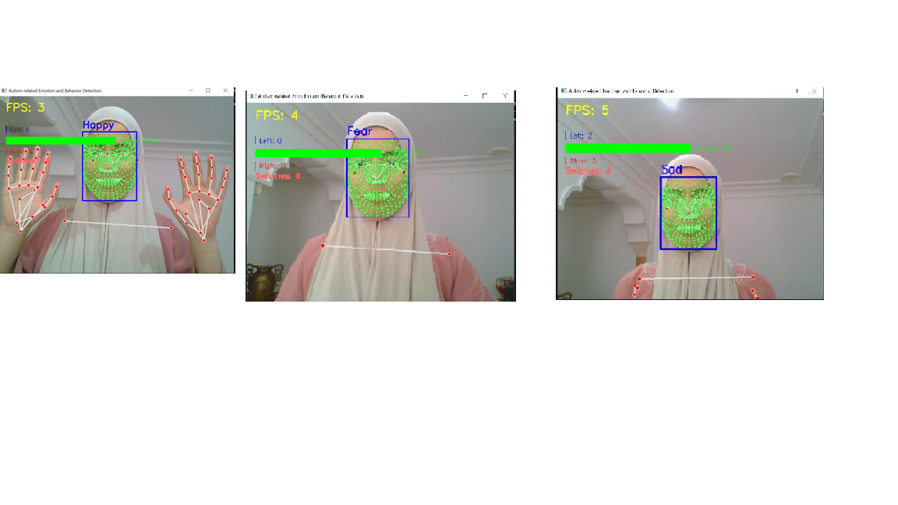

# TP7 - Détection d'émotions et suivi du regard en temps réel

## Démonstration

## Description
Système complet de détection d'émotions faciales et de suivi
du regard en temps réel développé dans le cadre du module
Introduction à l'Intelligence Artificielle.
École Supérieure de la Technologie, Tétouan - 2025-2026
Prof. Faouzi Marzouki

## Technologies
- Python 3.10
- TensorFlow 2.13 / Keras
- MediaPipe 0.10.9
- OpenCV

## Fonctionnalités
- Détection de 7 émotions (FER-2013) : Angry, Disgust, Fear, Happy, Sad, Surprise, Neutral
- Suivi du regard : Gauche / Centre / Droite
- Détection de fixation oculaire
- Export des données en CSV
- Affichage FPS en temps réel

## Installation
pip install tensorflow==2.13.0
pip install mediapipe==0.10.9
pip install opencv-python numpy

## Utilisation
python main_tracker.py

## Commandes clavier
| Touche | Fonction |
|--------|----------|
| f | Maillage facial complet |
| m | Yeux et bouche uniquement |
| p | Détection de posture |
| h | Détection des mains |
| g | Suivi du regard |
| r | Rectangle du visage |
| c | Désactiver tout |
| q | Quitter |

## Architecture
- `main_tracker.py` : Script principal
- `gaze_tracker_utils.py` : Calcul de la direction du regard
- `gaze_visualizer.py` : Visualisation des statistiques
- `gaze_logger.py` : Enregistrement CSV
